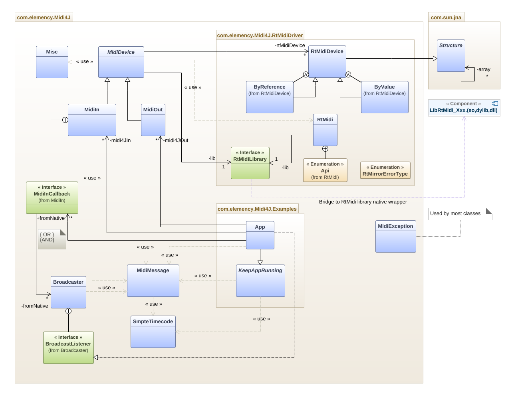

# Midi4J - (Rt)Midi for java

### Overview
Small Java Midi library *(w.i.p.)* bridged to a *'slightly'* revisited
[RtMidi](https://github.com/thestk/rtmidi)
cross platform realtime C++ [Midi](http://www.planetoftunes.com/midi-sequencing/midi-status-and-data-bytes.html) 
library via [JNA](https://github.com/java-native-access/jna) binding.

### What is RtMidi?
RtMidi is a set of classes providing a common API (Application Programming Interface) for realtime 
MIDI input/output across Linux *(ALSA, JACK)*, Macintosh OS X *(CoreMIDI, JACK)*, and Windows *(Multimedia Library)* 
operating systems.

### Huuuh! Another Java midi library... Why?
Well, it was done in view of future projects and as a fun exercise in my spare time to:
- Re-level-up my knowledge of the Midi protocol. 
- Learn:
    - How to create a small library with native binding *(my first one)*.
    - JNA *(to bind the C/C++ & Java worlds together)* 
    - The Alsa and Jack API.
    - Junit, Exceptions, Javadoc, Markdown, Gradle, UML etc...

- Discover:
    - Java development under Linux.
    - The sadly no longer developed [JnAerator](https://github.com/nativelibs4java/JNAerator) JNA utility.

### Philosophy:
One thing has tripped me quite a bit, at the beginning of learning RtMidi*, querying devices/ports always results 
to available **opposite** (target) devices...

For example:
```javascript
// RtMidi C excerpt to get port count.
RtMidiIn *midiin = 0;
midiin = new RtMidiIn();

unsigned int nPorts = midiin->getPortCount();
```
returns the number of available **Midi Out** devices *(not available Midi In devices)* even if reading the code 
could make one think otherwise.

So, in Midi4J, to try to ease possible confusions:
- User's created device instances are known as **source** devices/ports.
- All other devices/ports available on the system, are known as **target** devices/ports. 
```javascript
// Same as above in java with Midi4J naming convention.
boolean withUserCallback = false;
MidiIn midi4jIn = new MidiIn(withUserCallback);

int nPorts = midi4jIn.getTargetDeviceCount();
```
but also:
- To conform to Java's own naming conventions.
- To try to make method names and signatures self-explanatory.

the Midi4J's API is somewhat different from RtMidi.

### Midi4J's class diagram    


### Very simple example
Sends a D4 note on channel 1 for 1 second to IN target device and quit.<br>
More advanced samples are available in the 'Examples' package.
```javascript
import com.elemency.Midi4J.MidiMessage;
import com.elemency.Midi4J.MidiOut;
import com.elemency.Midi4J.RtMidiDriver.RtMidi;

public class Main {
    public static void main(String[] args) {
        MidiOut midi4jOut = new MidiOut(RtMidi.Api.LINUX_ALSA.getIntValue(), "Midi4J");

        if (midi4jOut.getTargetDeviceCount() < 1) {
            System.out.println("No target device available - quitting...");
            return;
        }

        midi4jOut.connect("OUT", 0, true); // src Port name, tgt port ID, auto connect

        // note name, middle C octave number        
        int noteNumber = MidiMessage.getNoteNumber("D4", 3);

        // channel, note, velocity, time stamp
        midi4jOut.sendMessage(MidiMessage.noteOn(1, noteNumber, 100, 0));
        Thread.sleep(1000);
        midi4jOut.sendMessage(MidiMessage.noteOn(1, noteNumber, 0, 0));
    }
}
```

### Licensing
- Midi4J is licensed under the [Apache license V2.0](http://www.apache.org/licenses/) with exception for its MidiMessage class which incorporates 
work, derived and translated from the C++ juce_MidiMessage class part of the JUCE library and covered under the very permissive [ISC](http://www.isc.org/downloads/software-support-policy/isc-license) License.

- RtMidi is distributed under its own [modified MIT](https://github.com/thestk/rtmidi/blob/master/LICENSE) License.

Further details can be found in the LICENSE file.


### Please Note
Midi4J is in its infancy and quite a few bugs are likely lurking around.<br>
Still, right now it seems to hold quite well, at least under Linux (Jack and Alsa Midi API), 
as I do not have the facility to test on Windows nor on MacOs.

Thank you for your interest - have fun with it!


### Known issues
- The Javadoc lacks a lot of tender and loving care!
- Receiving a huge amount of events (i.e. channel aftertouch) can sometimes generate a:<br>
``
java.lang.ArrayIndexOutOfBoundsException: Index 2 out of bounds for length 2.
``
- RtMidi's compiled binaries for Windows and MacOs are not yet provided as I do not have the necessary facility to produce them.<br> 
As Midi4J uses a slightly modified version of RtMidi (small hacks), (Windows, MacOs) binaries compiled from the original 
RtMidi won't work.<br>
The modified version of RtMidi, as well as a pull request to the original RtMidi developer(s), in case they think my 'hacks'
adds values to their current version, will be made available **asap**, in the meantime though, only the Linux 
binaries will be provided!


### Addendum:
**(this likely applies also to most, if not all, other Sound/Midi libraries)*.
